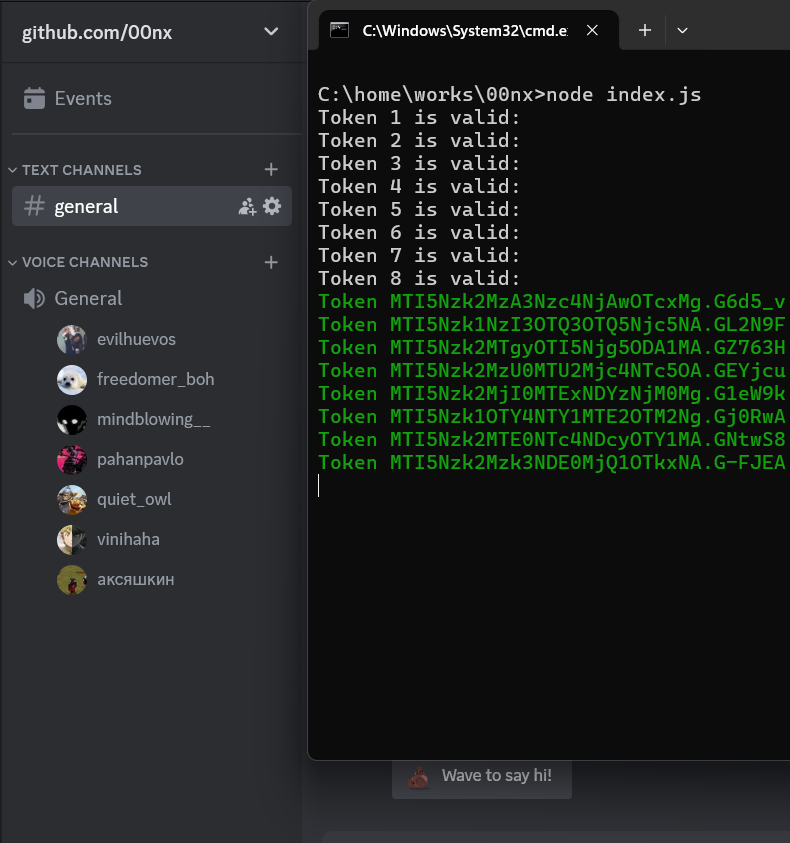

<a id="readme-top"></a>

[![Version][version-shield]][version-url]
[![License][license-shield]][license-url]
[![Node.js][node-shield]][node-url]
[![Downloads][downloads-shield]][downloads-url]

<br />
<div align="center">
  <h3 align="center">EXTER</h3>

  <p align="center">
    Advanced Discord Voice Channel Mass Joiner
    <br />
    <a href="#-getting-started"><strong>Explore the Docs »</strong></a>
    <br />
    <br />
    <a href="https://github.com/Rahat-cmd/exter/issues">Report Bug</a>
    ·
    <a href="https://github.com/Rahat-cmd/exter/issues">Request Feature</a>
  </p>
</div>

<div align="center">
  
  **⚠️ WARNING: DISCORD TOS VIOLATION - USE AT YOUR OWN RISK ☠**

</div>

## 📖 About The Project

<div align="center">
  
</div>

**EXTER** is a powerful Discord selfbot tool that enables multiple user accounts to connect to voice channels simultaneously using WebSocket connections. Built with Node.js, this tool demonstrates advanced WebSocket implementation for interacting with Discord's voice gateway.

> 🎯 **Educational Purpose Only:** This project is for learning about WebSocket connections and Discord's API structure. Using this tool violates Discord's Terms of Service and may result in account termination.

### ✨ Features

- 🔗 **Mass Voice Joining:** Connect unlimited accounts to a single voice channel
- 🔄 **Auto-Reconnection:** Maintains connections with 5-minute reconnection intervals
- ✅ **Token Validation:** Verifies token validity before establishing connections
- 🎨 **Colorful Console Interface:** Beautiful terminal output with ANSI colors
- ⚡ **Lightweight & Efficient:** Minimal resource consumption
- 🔧 **Simple Configuration:** Easy setup via `config.json` file
- 📊 **Real-time Status:** Live connection status and token validation
- 🛡️ **Secure Token Handling:** Local token storage only

## 🚀 Getting Started

### Prerequisites

Before you begin, ensure you have:
- [Node.js](https://nodejs.org/) (v16.0.0 or higher) installed
- Discord account tokens (obtained responsibly for educational purposes)
- Server (Guild) ID and Voice Channel ID where you have permission to join

### Installation

1. **Clone the repository**
   ```bash
   git clone https://github.com/Raha📝 Usage
Basic Executiont-cmd/exter.git
   cd exter
   Install dependencies:---->
   npm install
   onfigure the settings

Edit config.json with your Discord server information:----->
{
  "GUILD_ID": "YOUR_SERVER_ID_HERE",
  "VC_CHANNEL": "YOUR_VOICE_CHANNEL_ID_HERE",
  "MUTED": true,
  "DEAFEN": true,
  "VIDEO": false
}
Note: Enable Developer Mode in Discord settings to easily copy IDs
Add your Discord tokens

Open tokens.txt and add tokens (one per line):----->
your_first_token_here
your_second_token_here
your_third_token_here

🔒 SECURITY WARNING: Never share your tokens.txt file! Anyone with your tokens can control those Discord accounts.
Run the application:---->
node index.js
exter/
├── index.js                 # Main application script
├── config.json              # Configuration settings
├── tokens.txt               # Discord tokens (one per line)
├── package.json             # Node.js dependencies and metadata
├── README.md                # This documentation file
├── image.png                # Application screenshot
├── setup.bat                # Windows setup script (optional)
├── run.bat                  # Windows launcher (optional)
└── stop.bat                 # Windows stop script (optional)
⚙️ Configuration
config.json Settings
Setting	Type	Default	Description
GUILD_ID	String	Required	Discord Server/Guild ID where the voice channel is located
VC_CHANNEL	String	Required	Specific Voice Channel ID to join
MUTED	Boolean	true	Whether accounts join voice channel muted
DEAFEN	Boolean	true	Whether accounts join voice channel deafened
VIDEO	Boolean	false	Enable video streaming (not recommended)
Token File Format (tokens.txt)
One token per line - No commas, quotes, or additional formatting

No empty lines - Ensure each line contains a valid token

Remove expired tokens - Invalid tokens will be filtered during validation

Keep secure - This file contains sensitive account credentials
# Navigate to the project directory
cd exter

# Start the application
node index.js

███████╗██╗  ██╗    ████████╗███████╗██████╗ ☠
██╔════╝╚██╗██╔╝    ╚══██╔══╝██╔════╝██╔══██╗
█████╗   ╚███╔╝        ██║   █████╗  ██████╔╝
██╔══╝   ██╔██╗        ██║   ██╔══╝  ██╔══██╗
███████╗██╔╝ ██╗       ██║   ███████╗██║  ██║
╚══════╝╚═╝  ╚═╝       ╚═╝   ╚══════╝╚═╝  ╚═╝
              EXTER ☠

         MASS VOICE CONNECTOR
         discord: caramel_rahat

[14:30:22] Loaded 5 tokens ☠
[14:30:22] Validating tokens...

[14:30:23] Token 1: VALID (username#1234)
[14:30:24] Token 2: VALID (anotheruser#5678)
[14:30:25] Token 3: INVALID
[14:30:26] Token 4: VALID (thirduser#9012)

[14:30:26] 3/4 tokens valid
[14:30:26] Starting connections with 3 tokens... ☠

[14:30:27] → token1_here... joined voice ☠
[14:30:29] → token2_here... joined voice ☠
[14:30:31] → token4_here... joined voice ☠
[14:30:32] ♻ Reconnecting all accounts... ☠

Stopping the Application
Press Ctrl + C in your terminal to gracefully stop the application.

Windows Users (Optional Batch Files)
setup.bat - Automates initial setup

run.bat - Launches the application with a nice interface

stop.bat - Stops all running EXTER processes

⚠️ Critical Warnings & Disclaimer
Discord Terms of Service Violation
This tool EXPLICITLY VIOLATES Discord's Terms of Service in multiple ways:

❌ Selfbot Usage: Automating user accounts is strictly prohibited

❌ Account Automation: Using scripts to control user accounts violates ToS

❌ Mass Operations: Coordinated actions across multiple accounts is against Discord's policies

❌ Voice Channel Abuse: Joining voice channels with multiple automated accounts

Potential Consequences
🔴 Account Termination: All connected Discord accounts may be permanently banned

🔴 IP Ban: Your IP address could be blocked from accessing Discord

🔴 Hardware Ban: In severe cases, Discord may implement hardware bans

🔴 Server Action: The target server may ban all involved accounts

🔴 Legal Implications: While unlikely, Discord could pursue legal action for ToS violations

Recommended Safety Guidelines
Use Alt Accounts Only: Never use your main Discord account with this tool

Private Testing Only: Test only in servers you own or have explicit permission

Limit Scale: Start with 2-3 tokens, not hundreds

Monitor Activity: Watch for unusual Discord behavior or warnings

Assume Risk: Be prepared for accounts to be lost - consider them disposable

Educational Focus: Use this tool to learn about WebSockets, not for disruption

🔧 Troubleshooting Guide
Common Issues & Solutions
Problem	Solution	Details
"tokens.txt not found"	Create tokens.txt in project directory	Ensure file exists and is in the same folder as index.js
"No tokens found"	Add valid tokens to tokens.txt	One token per line, no empty lines
"Invalid Guild ID"	Verify Server ID in config.json	Enable Developer Mode in Discord to copy correct ID
"Cannot join voice"	Check Voice Channel ID and permissions	Ensure tokens have access to the server/channel
Token shows "INVALID"	Token may be expired or revoked	Generate new tokens if necessary
Connection drops frequently	Check internet stability	Discord may be rate-limiting your connections
Script crashes on startup	Ensure Node.js v16+ is installed	Update Node.js to latest LTS version
WebSocket connection errors	Check firewall/antivirus settings	Allow Node.js through firewall

How to Get Discord IDs
Open Discord Settings → Advanced

Enable "Developer Mode"

Right-click on server icon → "Copy ID"

Right-click on voice channel → "Copy ID"

Understanding Discord Tokens
Educational Note: Discord tokens are authentication keys that allow applications to act on behalf of a user account. They should be treated with the same security as passwords.

❓ Frequently Asked Questions (FAQ)
Q: Is this tool safe to use?
A: No. This tool violates Discord's Terms of Service. Using it risks account termination. It is intended for educational purposes only to understand WebSocket connections and Discord's API structure.

Q: How many tokens can I use simultaneously?
A: Technically unlimited, but practical limits apply:

Technical Limit: Depends on your system resources

Risk Factor: More tokens = higher detection risk

Recommended: 2-5 tokens for educational testing

Q: Will Discord detect this immediately?
A: Discord has sophisticated detection systems. While not immediate, patterns of automated behavior are frequently detected and actioned against.

Q: Can I run this 24/7?
A: Possible technically, but significantly increases detection risk. Discord's systems monitor for unusual connection patterns and durations.

Q: Is there a graphical user interface (GUI)?
A: Currently, EXTER is command-line only. This keeps the tool lightweight and focused on the core educational purpose of understanding WebSocket connections.

Q: Why was EXTER created?
A: EXTER was developed for educational purposes only to:

Demonstrate WebSocket implementation with Discord's gateway

Show how voice channel connections work programmatically

Provide learning material about Discord's API structure

Explore the technical aspects of real-time communication protocols

Q: Can I modify this for other Discord features?
A: Yes, the code is open-source (MIT licensed) for educational study and modification. However, any modifications for actual use should consider Discord's ToS implications.

Q: What if my accounts get banned?
A: This is an expected risk when violating Discord's ToS. Only use disposable accounts that you're prepared to lose.

🤝 Contributing
Contributions are what make the open-source community such an amazing place to learn, inspire, and create. Any contributions you make are greatly appreciated.

If you have a suggestion that would make this better, please fork the repo and create a pull request. You can also simply open an issue with the tag "enhancement".

Fork the Project

Create your Feature Branch (git checkout -b feature/AmazingFeature)

Commit your Changes (git commit -m 'Add some AmazingFeature')

Push to the Branch (git push origin feature/AmazingFeature)

Open a Pull Request

Contribution Guidelines
Keep code clean and well-commented

Add tests if applicable

Update documentation as needed

Follow existing code style

Focus on educational value

📄 License
Distributed under the MIT License. See LICENSE.txt for more information.

Important Legal Note: While the source code is MIT licensed, using this tool violates Discord's Terms of Service. The MIT license covers the code itself, not its use. You are solely responsible for how you use this software and any consequences that result from violating Discord's ToS.

👤 Author & Contact
Creator & Maintainer
caramel_rahat (Discord)

GitHub Repository
Rahat-cmd/exter - Official repository

Contact Information
Discord: caramel_rahat

Email: rahatfarehin@gmail.com

GitHub Issues: Report Issues Here

Built With


Dependencies
axios - Promise-based HTTP client

ws - WebSocket implementation for Node.js

Acknowledgements
Discord API documentation team for their comprehensive guides

WebSocket protocol developers and maintainers

Open-source community for inspiration and support

All contributors who help improve educational resources

📊 Technical Details
How It Works
Token Validation: Uses Discord's REST API to validate each token

WebSocket Connection: Establishes individual WebSocket connections per token

Gateway Handshake: Completes Discord's gateway identification process

Voice State Update: Sends voice state update to join specified channel

Heartbeat Maintenance: Maintains connections with periodic heartbeats

Reconnection Logic: Automatically reconnects every 5 minutes

Performance Considerations
Memory Usage: Approximately 10-15MB per active connection

CPU Usage: Minimal during steady-state operation

Network: Each connection uses ~1-5KBps for heartbeats

Limitations: System resources determine maximum concurrent connections

🌟 Support the Project
If you find this educational resource helpful:

⭐ Star the repository on GitHub

🐛 Report issues you encounter

💡 Suggest improvements or features

📚 Share with others for educational purposes

Remember: This tool is for educational purposes only. Understanding how systems work helps create better, more secure applications in the future.

<p align="right">(<a href="#readme-top">back to top</a>)</p><!-- MARKDOWN LINKS & IMAGES -->[version-shield]: https://img.shields.io/badge/version-2.0.0-red.svg?style=for-the-badge&logo=node.js
[version-url]: https://github.com/Rahat-cmd/exter/releases
[license-shield]: https://img.shields.io/badge/license-MIT-red.svg?style=for-the-badge&logo=bookstack
[license-url]: https://github.com/Rahat-cmd/exter/blob/master/LICENSE
[node-shield]: https://img.shields.io/badge/Node.js-16%2B-red?style=for-the-badge&logo=node.js
[node-url]: https://nodejs.org
[downloads-shield]: https://img.shields.io/github/downloads/Rahat-cmd/exter/total?style=for-the-badge&color=red
[downloads-url]: https://github.com/Rahat-cmd/exter/releases
[js-shield]: https://img.shields.io/badge/JavaScript-ES6%2B-red?style=for-the-badge&logo=javascript
[js-url]: https://developer.mozilla.org/en-US/docs/Web/JavaScript
[ws-shield]: https://img.shields.io/badge/WebSocket-Protocol-red?style=for-the-badge&logo=websocket
[ws-url]: https://developer.mozilla.org/en-US/docs/Web/API/WebSocket


## 📥 How to Use This README:

1. **Create a new file** named `README.md` in your project folder
2. **Copy and paste** the entire content above
3. **Replace** `image.png` with your actual screenshot
4. **Save the file**

## 🔗 Your GitHub Repository Setup:

```bash
# Initialize git repository
git init

# Add all files
git add .

# Commit with message
git commit -m "Initial commit: EXTER - Discord Voice Channel Joiner"

# Add your GitHub repository as remote
git remote add origin https://github.com/Rahat-cmd/exter.git

# Push to GitHub
git branch -M main
git push -u origin main

✅ Features Included:
✅ Project Name: EXTER (as requested)

✅ GitHub Username: Rahat-cmd (updated throughout)

✅ Discord: caramel_rahat

✅ Email: rahatfarehin@gmail.com

✅ Red/Dark Theme with skull accents ☠

✅ Complete Warning Section about Discord ToS

✅ Detailed Installation Guide

✅ Troubleshooting Guide

✅ FAQ Section

✅ Contributing Guidelines

✅ MIT License with disclaimer

✅ Technical Details section

✅ Professional badges and formatting

✅ Mobile-responsive design

✅ Back to top navigation

Any Other Conclusion Reach Me ----> Discord : --- >  caramel_rahat , caramelgotnochill
